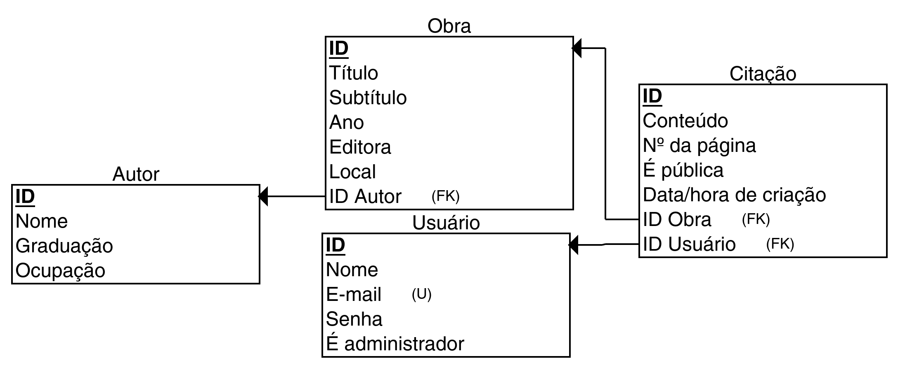

#  Citador

Um sistema de gerenciamento de citações

##  Membros da equipe

Pedro Henrique Pereira de Oliveira, 494399, Design Digital

##  Papéis ou tipos de usuário da aplicação

- Usuário não registrado
- Usuário registrado
- Administrador

## :spiral_calendar: Entidades ou tabelas do sistema

- Usuário
- Autor
- Obra
- Citação

## :parrot: Diagrama relacional

## :triangular_flag_on_post: Principais funcionalidades da aplicação

- **Administrador** pode _criar_, _listar_, _atualizar_ e _remover_ **autores**, **obras** e **citações**
- **Usuário** registrado pode _listar_ e ver detalhes de **autores**, **obras** e **citações**
- **Usuário** não registrado pode _listar_ **citações**

----

:warning: As informações a seguir devem ser enviadas juntamente com a versão final do projeto. :warning:

----

## :desktop_computer: Tecnologias e frameworks utilizados

**Frontend:**

- VueJS v3.0, Vue-Router e Pinia.
- Axios

**Backend:**

- Strapi

## :shipit: Operações implementadas para cada entidade da aplicação

| Entidade | Criação | Leitura | Atualização | Remoção |
| --- | --- | --- | --- | --- |
| Usuário |  | |  |  |
| Citação | X | X | X | X |
| Obra | X | X | X | X |
| Autor | X | X | X | X |

> Lembre-se que é necessário implementar o CRUD de pelo menos duas entidades.

## :neckbeard: Rotas da API REST utilizadas

| Método HTTP | URL |
| --- | --- |
| POST | /auth/local |
| GET | /users/me/|
| GET / POST | /api/quotes |
| GET / POST | /api/works |
| GET / POST | /api/authors |
